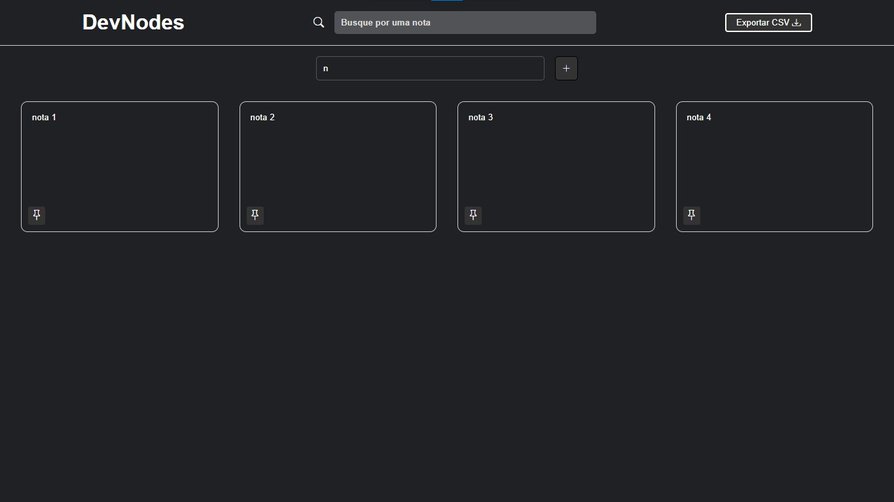

# DevNodes
Desenvolvido: HTML, css, JavaScript

Este é um site de anotações onde o usuário pode:

* Criar notas
* Excluir notas
* Fazer cópias das notas
* Fixar notas no topo
* Atualizar notas

Todas essas funcionalidades são realizadas utilizando o local storage do navegador. Além disso, o usuário pode exportar as notas em formato CSV.

## Preveiw
_**Está responsivo para dotos os dispositivos**_ 📱💻

Clique [aqui](https://elson-341.github.io/DevNodes/) para acessar o site.

